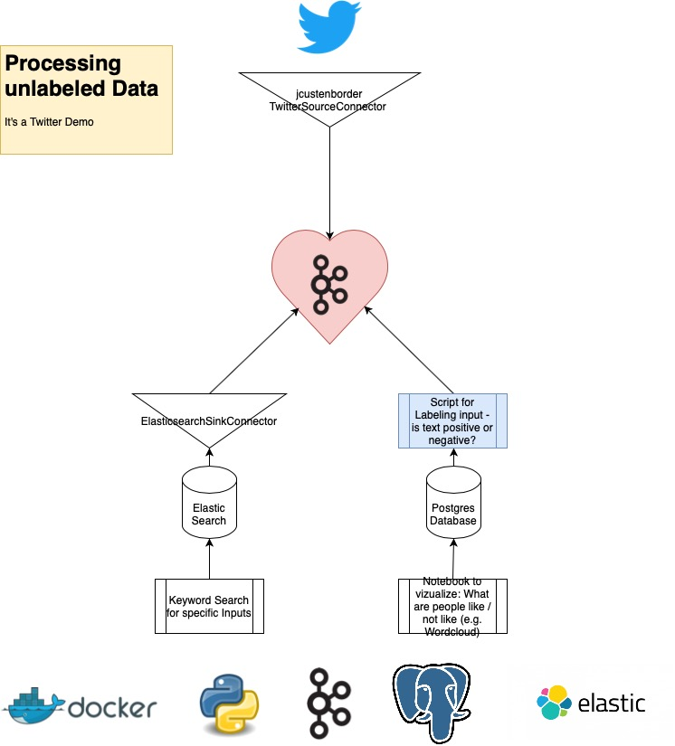

# Twitter Integrationdemo - Readme



This repository put Kafka between an external source `Twitter` and
proceed data into the System for making analyzes on unlabeled tweets.

## Requirements & Setup
- Docker
- Jupyter Notebook
- Twitter Developer Account (it's free for 500k requests per month)

**Please Note** This notebook does not provide any virtual environment
or setup. You need to install following packages:
- pandas
- sqlalchemy
- psycopg2-binary
- requests
- matplotlib
- wordcloud
- scattertext

But this setup is not required for starting the docker composition.
It's just for additional analyzes.

### Setup
1. Installing submodules
```
git submodule init
git submodule update
```

2. creating `twitter-source.json`
```
cp connect/connector_properties/twitter_source.example.json \
    connect/connector_properties/twitter_source.json
```
You need to set values for
- twitter.oauth.consumerKey
- twitter.oauth.consumerSecret
- twitter.oauth.accessToken
- twitter.oauth.accessTokenSecret

**Please Note:** You have to have a real developer account at twitter.
It's for free until 500k requests within a month. You do not have to
provide any credit card information. If you have more than 500k
requests within a month, your account will be blocked until next
month.

3. Starting the compositions
```
bash demorun.bash
```

**Please Note:** This will create a source connector to twitter. You
should delete it after some minutes / you should check your request
count by taking a look at the database where the data is stored into ;-)

4. Deleting the twitter connector
```
curl -i -X DELETE http://localhost:8083/connectors/SourceTwitterConnector
```


## Workflow
The Repository is divided into different services:
1. Twitter Source Connector
2. Kafka & Confluent tools
3. a custom consumer script in Python for realtime classification and
    language detection
4. elasticsearch for having an optimized keyword search or other
    text-based searches or general searches for unstructured data
5. Jupyter Notebook text visualization and API Tool for Elastic

The goal for this repository in general is to receive and proceed
real tweets for some specific keywords in realtime from twitter.

An NLP should identify the tweet as positive or negative tweets,
identify the language and write them into a postgres database.
__Please Note__ The NLP is not done yet. I've made some try's on it,
but I had an accuracy of 3%. The texts are classified randomly as
positive or negative for getting a feeling about functionality and
potential of this workflow.

An Elasticsearch connector is writing the fetched data from twitter
parallel into an Elasticsearch cluster - these processes are
completely asynchronous and independent from each other.

A Jupyter Notebook is used as a graphical user interface (UI/UX at
it's best - lol). You will be able to visualize
- Words which are high frequency in use for negative and positive
- Have a Scatterplot to compare both categories directly and see
    trends much better than within the other plot

In addition to that: You will be able to query for specific keywords
through elasticsearch. That helps to bring the keywords into context.

## Known Bugs
- Docker-Compose ordering is important. It should be solved by using
    the bash script to setup

- Sometimes the bash script starts, sometimes not. It depends on
    health state of Kafka, Zookeeper or something else. Check in an
    additional terminal by using `docker ps` which services are up
    and running if you wait to long for a connection to kafka
    connect. You might need to restart this process.

- Scatterplot is not embedded in Jupyter Notebook. It will be stored
    at your local filesystem and you need to open it outside of
    jupyter notebook. It will be created out of HTML and JS.
